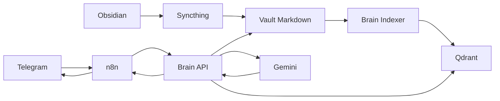

# Second Brain

> Um sistema pessoal de memória aumentada que transforma anotações do Obsidian em uma base de conhecimento consultável por linguagem natural.

O **Second Brain** conecta notas em Markdown, busca vetorial, automação e inteligência artificial para permitir que você consulte o que já escreveu sem precisar procurar manualmente entre dezenas ou centenas de arquivos.

A ideia é simples: você continua escrevendo normalmente no Obsidian. O sistema acompanha essas notas, gera embeddings, indexa o conteúdo no Qdrant e usa uma API em FastAPI para recuperar informações relevantes. Quando necessário, o Gemini usa esse contexto para gerar uma resposta natural.

```text
Você escreve
    ↓
O sistema indexa
    ↓
Você pergunta
    ↓
O sistema procura
    ↓
A IA responde com base nas suas próprias notas
```

---

## Sumário

- [Visão geral](#visão-geral)
- [Exemplo simples](#exemplo-simples)
- [Arquitetura](#arquitetura)
- [Como o Vault pode ser organizado](#como-o-vault-pode-ser-organizado)
- [Como cada parte funciona](#como-cada-parte-funciona)
- [Tecnologias](#tecnologias)
- [Estrutura do repositório](#estrutura-do-repositório)
- [Pré-requisitos](#pré-requisitos)
- [Configuração](#configuração)
- [Execução](#execução)
- [Brain API](#brain-api)
- [Brain Indexer](#brain-indexer)
- [Telegram e n8n](#telegram-e-n8n)
- [Segurança](#segurança)
- [Testes](#testes)
- [Roadmap](#roadmap)
- [Contribuição](#contribuição)
- [Licença](#licença)

---

# Visão geral

O projeto foi criado para funcionar como uma **segunda memória digital**.

Imagine alguém estudando para um vestibular e mantendo vários cadernos com matérias, resumos, conceitos e anotações. Com o tempo, encontrar uma informação específica pode se tornar difícil.

O Second Brain transforma essas anotações em uma base pesquisável semanticamente.

Em vez de abrir várias notas até encontrar uma informação, você pode perguntar:

```text
Qual é a função do coração?
```

O sistema procura conteúdos relacionados nas suas próprias notas e usa esses trechos como contexto para gerar a resposta.

---

# Exemplo simples

Imagine um Vault organizado assim:

```text
vault/
├── 00 Caixa de Entrada/
├── 10 Memória/
├── 20 Projetos/
├── 30 Conhecimento/
├── 40 Áreas/
├── 50 Referências/
├── 60 Diário/
├── 90 Legado/
└── 99 Arquivo/
```

Dentro de `30 Conhecimento`:

```text
30 Conhecimento/
└── Anatomia/
    └── Sistema cardiovascular.md
```

A nota poderia conter:

```markdown
# Sistema cardiovascular

O coração é responsável por bombear o sangue pelo organismo.
```

Depois, uma pergunta como:

```text
Qual é a função do coração?
```

pode ser respondida com base nesse conteúdo.

---

# Arquitetura

```text
Obsidian
   ↓
Syncthing
   ↓
Vault Markdown
   ↓
Brain Indexer
   ↓
Embeddings
   ↓
Qdrant
   ↓
Brain API
   ↓
Gemini
   ↓
n8n
   ↓
Telegram
```



## Fluxo de uma pergunta

```text
Usuário envia uma pergunta pelo Telegram
                ↓
             n8n
                ↓
           Brain API
                ↓
     identifica a intenção
                ↓
       pesquisa no Qdrant
                ↓
 recupera trechos relevantes
                ↓
       consulta o Gemini
                ↓
        gera a resposta
                ↓
              n8n
                ↓
            Telegram
```

---

# Como o Vault pode ser organizado

## `00 Caixa de Entrada`

Área temporária para informações ainda não organizadas.

Pode conter ideias rápidas, links, lembretes e anotações soltas.

## `10 Memória`

Armazena informações que você deseja manter como memória pessoal ou operacional.

Exemplos:

- decisões;
- preferências;
- configurações importantes;
- aprendizados pessoais;
- informações recorrentes.

Exemplo:

```markdown
# Banco de dados do Second Brain

Foi decidido utilizar PostgreSQL como banco do n8n.
```

## `20 Projetos`

Contém informações relacionadas a projetos com objetivo específico.

Exemplo:

```text
20 Projetos/
├── Second Brain/
├── Aplicativo Mobile/
└── Automação Residencial/
```

## `30 Conhecimento`

É a base principal de estudo e conhecimento.

Pode conter:

```text
Linux
Docker
Redes
Banco de dados
Programação
Anatomia
Matemática
História
```

Essa pasta tende a ser uma das mais úteis para consultas semânticas.

## `40 Áreas`

Representa responsabilidades ou áreas contínuas da vida.

Exemplos:

```text
Carreira
Estudos
Finanças
Saúde
Infraestrutura
```

## `50 Referências`

Funciona como uma biblioteca pessoal.

Pode conter artigos, livros, links, manuais, comandos e documentação técnica.

## `60 Diário`

Armazena registros cronológicos.

Exemplo:

```text
60 Diário/
├── 2026-09-20.md
├── 2026-09-21.md
└── 2026-09-22.md
```

Pode registrar acontecimentos, tarefas, problemas, decisões e aprendizados.

## `90 Legado`

Armazena informações antigas que ainda podem ter utilidade.

Exemplos:

- sistemas antigos;
- configurações descontinuadas;
- projetos antigos;
- documentação histórica.

## `99 Arquivo`

Destino para conteúdos que não estão mais ativos.

Exemplos:

- projetos finalizados;
- documentação encerrada;
- notas antigas;
- materiais preservados.

---

# Como cada parte funciona

## Obsidian

Usado para escrever e organizar as notas. O conteúdo permanece em arquivos Markdown comuns.

## Syncthing

Pode sincronizar o Vault entre notebook e servidor.

```text
Notebook
   ↓
Syncthing
   ↓
Servidor
```

## Brain Indexer

Transforma notas em conteúdo pesquisável semanticamente.

```text
Markdown
   ↓
leitura
   ↓
chunking
   ↓
embeddings
   ↓
Qdrant
```

## Embeddings

Representações numéricas do significado do texto.

O projeto utiliza:

```text
intfloat/multilingual-e5-base
```

## Qdrant

Banco vetorial responsável por armazenar embeddings e recuperar trechos semanticamente próximos à pergunta.

## Brain API

API em FastAPI responsável por:

- autenticação;
- busca semântica;
- roteamento de intenção;
- consulta ao Vault;
- integração com Qdrant;
- integração com Gemini;
- análise e gravação de memória.

## Gemini

Modelo de linguagem utilizado para interpretar a pergunta e gerar respostas a partir do contexto recuperado.

## n8n

Camada de automação.

Fluxo típico:

```text
Telegram Trigger
      ↓
HTTP Request
      ↓
Brain API
      ↓
Send Message
```

## Telegram

Interface conversacional opcional para consultar o Second Brain.

---

# Tecnologias

| Tecnologia | Função |
| --- | --- |
| Python | Linguagem principal |
| FastAPI | API |
| Sentence Transformers | Embeddings |
| multilingual-e5-base | Modelo de embeddings |
| Qdrant | Banco vetorial |
| Gemini | Modelo de linguagem |
| Obsidian | Gerenciamento das notas |
| Syncthing | Sincronização |
| n8n | Automação |
| Telegram | Interface conversacional |
| PostgreSQL | Persistência do n8n |
| Docker | Containerização |
| Docker Compose | Orquestração |
| Traefik | Reverse proxy |
| Git / GitHub | Versionamento |

---

# Estrutura do repositório

```text
second-brain-public/
├── brain-api/
├── brain-indexer/
├── compose/
├── examples/
├── .env.example
├── .gitignore
├── CONTRIBUTING.md
├── LICENSE
├── README.md
└── SECURITY.md
```

## `brain-api/`

```text
brain-api/
├── .dockerignore
├── Dockerfile
├── app.py
└── requirements.txt
```

- `app.py`: lógica principal da API.
- `Dockerfile`: construção da imagem.
- `requirements.txt`: dependências Python.
- `.dockerignore`: exclui arquivos desnecessários do build.

## `brain-indexer/`

```text
brain-indexer/
├── .dockerignore
├── Dockerfile
├── index_vault.py
├── requirements.txt
├── tests/
│   ├── create_test_index.py
│   └── semantic_search_test.py
└── watch_indexer.py
```

- `watch_indexer.py`: monitora alterações no Vault.
- `index_vault.py`: indexação manual/completa.
- `tests/`: validação do Qdrant e da busca semântica.

## `compose/`

```text
compose/
└── docker-compose.example.yml
```

Define:

- PostgreSQL;
- Qdrant;
- Brain API;
- Brain Indexer;
- n8n;
- redes;
- volumes;
- healthchecks;
- integração com Traefik.

## `examples/`

```text
examples/
└── sample-vault/
```

Deve conter apenas dados fictícios para demonstração e testes.

---

# Pré-requisitos

- Docker;
- Docker Compose;
- chave da API Gemini;
- diretório para o Vault;
- Traefik, caso utilize a configuração de reverse proxy;
- bot do Telegram e n8n, caso queira a interface via Telegram.

---

# Configuração

Clone:

```bash
git clone https://github.com/juanhenrique1306/second-brain-public.git
cd second-brain-public
```

Crie o arquivo de ambiente:

```bash
cp .env.example .env
```

Edite:

```bash
nano .env
```

Nunca versione o `.env`.

---

# Execução

Se a rede do Traefik ainda não existir:

```bash
docker network create proxy
```

Valide:

```bash
docker compose   --env-file .env   -f compose/docker-compose.example.yml   config
```

Build:

```bash
docker compose   --env-file .env   -f compose/docker-compose.example.yml   build
```

Suba os serviços:

```bash
docker compose   --env-file .env   -f compose/docker-compose.example.yml   up -d
```

Verifique:

```bash
docker ps
```

---

# Brain API

Endpoints principais:

```text
GET  /
GET  /health

POST /search
POST /route
POST /memory/analyze
POST /memory/write
POST /ask
```

As rotas protegidas utilizam:

```text
X-API-Key
```

Exemplo:

```bash
curl   -X POST   http://127.0.0.1:8000/ask   -H "Content-Type: application/json"   -H "X-API-Key: YOUR_BRAIN_API_KEY"   -d '{"query":"O que é o Second Brain?"}'
```

---

# Brain Indexer

O container executa `watch_indexer.py` para monitoramento contínuo.

O `index_vault.py` pode ser usado para indexação manual.

A variável:

```env
RECREATE_COLLECTION=false
```

fica desativada por padrão para evitar exclusão acidental da collection.

---

# Telegram e n8n

Fluxo básico:

```text
Telegram Trigger
      ↓
HTTP Request
      ↓
POST /ask
      ↓
Send Message
```

O n8n deve enviar:

```text
X-API-Key
```

com o mesmo valor de:

```env
BRAIN_API_KEY
```

As credenciais do Telegram devem ser configuradas diretamente no n8n.

Nunca publique tokens, credential IDs reais ou API keys.

---

# Segurança

Idealmente:

```text
Internet
   ↓
Traefik
   ↓
somente endpoints necessários
```

Enquanto:

```text
PostgreSQL
Qdrant
Brain API
```

devem permanecer internos ou restritos.

Recomendações:

- não exponha PostgreSQL publicamente;
- não exponha Qdrant publicamente;
- proteja a Brain API com API key;
- mantenha o editor n8n atrás de VPN ou allowlist;
- utilize HTTPS;
- não publique seu Vault real;
- não publique `.env`;
- não publique tokens ou chaves;
- não exponha dashboards administrativos sem proteção.

Consulte `SECURITY.md`.

---

# Testes

Valide a sintaxe:

```bash
python3 -m py_compile brain-api/app.py
python3 -m py_compile brain-indexer/watch_indexer.py
python3 -m py_compile brain-indexer/index_vault.py
```

Scripts auxiliares:

```text
brain-indexer/tests/create_test_index.py
brain-indexer/tests/semantic_search_test.py
```

---

# O que não deve ser versionado

Nunca envie:

```text
.env
Vault real
bancos PostgreSQL
dados do Qdrant
dados do n8n
modelos baixados
tokens
API keys
certificados privados
chaves SSH
backups
logs sensíveis
```

Sempre confira:

```bash
git status
```

antes de commitar.

---

# Roadmap

- documentação detalhada da arquitetura;
- guia completo de instalação;
- guia do Telegram;
- workflow n8n sanitizado;
- Vault de exemplo;
- testes automatizados;
- observabilidade;
- timeout e tratamento de erro do modelo de linguagem;
- melhoria do fluxo de memória;
- novos canais de entrada;
- documentação de Traefik e VPN;
- CI para validação do código e Compose.

---

# Contribuição

Consulte `CONTRIBUTING.md`.

Fluxo sugerido:

```bash
git checkout -b feature/minha-melhoria
git add .
git commit -m "feat: minha melhoria"
git push origin feature/minha-melhoria
```

---

# Privacidade

As notas podem permanecer sob controle do usuário no próprio servidor.

Entretanto, quando uma requisição utiliza um modelo de linguagem externo, o contexto enviado para esse provedor pode sair da infraestrutura local.

Avalie quais informações podem ser enviadas para APIs externas.

---

# Objetivo

> Transformar anotações pessoais em uma memória digital pesquisável e conversacional.

```text
Você escreve
    ↓
O sistema lembra
    ↓
Você pergunta
    ↓
Ele procura
    ↓
A IA responde
```

---

# Status

Projeto em desenvolvimento.

---

# Licença

MIT. Consulte `LICENSE`.
